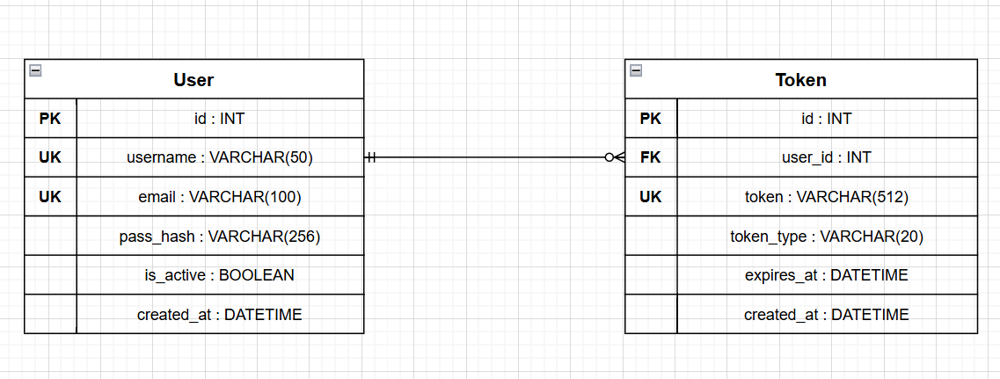

# S1 — Auth Service (Сервис аутентификации)

Сервис отвечает за регистрацию пользователей, вход по логину/паролю, выдачу токенов и сброс пароля. **Не хранит** профильные данные (ФИО, фото, контакты) — они управляются Profile Service.

---

## Зарегистрировать пользователя

Информация, требуемая для создания пользователя:

| Параметр  | Пояснение               | Обязательность | Тип    | Ограничение                      | Значение по умолчанию |
|-----------|-------------------------|----------------|--------|----------------------------------|-----------------------|
| username  | Имя пользователя        | Да             | string | 3–50 символов, только a-z 0-9 _ | —                     |
| email     | Электронная почта       | Да             | string | формат email, до 100 символов    | —                     |
| password  | Пароль                  | Да             | string | не менее 8 символов              | —                     |

**Уникальные комбинации параметров:**
- `username` — уникально глобально.
- `email` — уникально глобально.

Информация, возвращаемая при успешной регистрации:

| Параметр   | Тип     |
|------------|---------|
| id         | integer |
| username   | string  |
| email      | string  |
| is_active  | boolean |
| created_at | string  |

---

## Войти (авторизация)

Информация, требуемая для входа:

| Параметр  | Пояснение         | Обязательность | Тип    | Ограничение         | Значение по умолчанию |
|-----------|-------------------|----------------|--------|---------------------|-----------------------|
| username  | Имя пользователя  | Да             | string | 3–50 символов       | —                     |
| password  | Пароль            | Да             | string | не менее 8 символов | —                     |

Информация, возвращаемая при успешном входе:

| Параметр   | Тип    |
|------------|--------|
| token      | string |
| expires_at | string |

---

## Обновить токен

Информация, требуемая для обновления токена:

| Параметр | Пояснение          | Обязательность | Тип    | Ограничение               | Значение по умолчанию |
|----------|--------------------|----------------|--------|---------------------------|-----------------------|
| token    | Действующий токен  | Да             | string | не пустой, существует в БД | —                    |

Информация, возвращаемая при успешном обновлении:

| Параметр   | Тип    |
|------------|--------|
| token      | string |
| expires_at | string |

---

## Деактивировать пользователя по ID

Информация, требуемая для деактивации:

| Параметр | Пояснение              | Обязательность | Тип     | Ограничение       | Значение по умолчанию |
|----------|------------------------|----------------|---------|-------------------|-----------------------|
| id       | ID пользователя        | Да             | integer | существует в БД   | —                     |

Вернёт `true`, если пользователь был деактивирован (`is_active = false`), иначе `false`. Физически запись из БД не удаляется.

---

## Запросить сброс пароля

Информация, требуемая для запроса сброса пароля:

| Параметр | Пояснение          | Обязательность | Тип    | Ограничение      | Значение по умолчанию |
|----------|--------------------|----------------|--------|------------------|-----------------------|
| email    | Email пользователя | Да             | string | существует в БД  | —                     |

Информация, возвращаемая при успешном запросе:

| Параметр | Тип     |
|----------|---------|
| success  | boolean |

---

## Сбросить пароль

Информация, требуемая для сброса пароля:

| Параметр | Пояснение         | Обязательность | Тип    | Ограничение              | Значение по умолчанию |
|----------|-------------------|----------------|--------|-------------------------|-----------------------|
| token    | Токен сброса      | Да             | string | действующий токен сброса | —                    |
| new_pass | Новый пароль      | Да             | string | не менее 8 символов      | —                    |

Информация, возвращаемая при успешном сбросе:

| Параметр | Тип     |
|----------|---------|
| success  | boolean |

---

## Получить пользователя по ID

Информация, требуемая для получения пользователя:

| Параметр | Пояснение       | Обязательность | Тип     | Ограничение     | Значение по умолчанию |
|----------|-----------------|----------------|---------|------------------|-----------------------|
| id       | ID пользователя | Да             | integer | существует в БД | —                     |

Информация, возвращаемая при успешном поиске:

| Параметр   | Пояснение               | Тип     |
|------------|-------------------------|---------|
| id         | Идентификатор           | integer |
| username   | Имя пользователя        | string  |
| email      | Электронная почта       | string  |
| is_active  | Активен ли пользователь | boolean |
| created_at | Дата регистрации        | string  |

---

## Получить список пользователей по заданным параметрам

| Параметр  | Пояснение              | Тип     |
|-----------|------------------------|---------|
| is_active | Фильтр по активности   | boolean |
| search    | Поиск по username      | string  |
| limit     | Количество записей     | integer |
| offset    | Смещение               | integer |

Информация возвращается в виде списка пользователей, каждый содержит:

| Параметр   | Пояснение               | Тип     |
|------------|-------------------------|---------|
| id         | Идентификатор           | integer |
| username   | Имя пользователя        | string  |
| email      | Электронная почта       | string  |
| is_active  | Активен ли пользователь | boolean |
| created_at | Дата регистрации        | string  |

---

## ER-диаграмма

